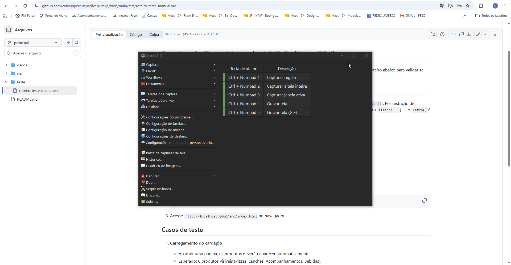

# Delivery Fácil - MVP Front-End

Projeto desenvolvido para a disciplina **MVP Front-End Development**
(Unifeso, curso de ADS, polo Teresópolis), sob orientação do
Prof. Msc. Rodrigo Braga.

## Integrantes da Equipe

| Nome          | Matrícula | Função                     |
|---------------|-----------|-----------------------------|
| Carlos Henrique Perrut Soares | 06020357  | Desenvolvimento Front-End   |
| Pedro Henrique de Souza Cardoso | 06019569  | Desenvolvimento Front-End   |
 Lucas de Almeida Gomes | 06014382  | Desenvolvimento Front-End   |
> Projeto iniciado individualmente. Novos integrantes serão adicionados
> a esta tabela conforme entrarem na equipe.

## Situação-Problema

Muitos pequenos restaurantes e lanchonetes não possuem um sistema próprio
para receber pedidos de delivery, dependendo de aplicativos de terceiros
com taxas altas. Este projeto propõe um MVP de um sistema simples de
pedidos de delivery, onde o cliente pode visualizar o cardápio, montar
seu pedido e finalizar a compra.

## Descrição do MVP

O MVP consiste em uma página web (front-end) que:

- Exibe um cardápio de produtos (carregado dinamicamente de um arquivo
  de dados `produtos.json`);
- Permite ao usuário adicionar produtos ao carrinho;
- Calcula o valor total do pedido automaticamente;
- Permite finalizar o pedido (simulação, sem back-end nesta etapa).

Este é o primeiro estágio do projeto, focado exclusivamente no
**front-end**. Em etapas futuras da disciplina, o projeto será
expandido com Back-End (persistência real dos pedidos) e Mobile.

## Demonstração

Veja abaixo como executar o MVP localmente e o sistema funcionando:



## Tecnologias Utilizadas

- HTML5
- CSS3
- JavaScript (Vanilla JS)

## Estrutura do Projeto

```
delivery-mvp/
├── src/            # Código-fonte do MVP
│   ├── index.html
│   ├── style.css
│   └── script.js
├── data/           # Dados utilizados pela aplicação
│   └── produtos.json
├── test/           # Roteiro de testes
│   └── roteiro-teste-manual.md
├── docs/           # Documentação (GIF de demonstração)
│   └── demo-execucao.gif
└── README.md
```

## Como Executar Localmente

1. Faça o download ou clone este repositório.
2. O projeto carrega os produtos de um arquivo JSON, então **não funciona
   abrindo o `index.html` com duplo clique**. É necessário um servidor local.
3. Abra o terminal na **raiz do projeto** (pasta `delivery-mvp`) e execute:
```
   python -m http.server
```
4. Acesse `http://localhost:8000/src/index.html` no navegador.

Alternativa: use a extensão "Live Server" do VS Code (botão direito em
`src/index.html` e "Open with Live Server").

## Informações Adicionais

Este projeto faz parte de um trabalho continuado: o MVP desenvolvido
aqui no Front-End servirá de base para as próximas disciplinas de
Back-End e Mobile Development.
